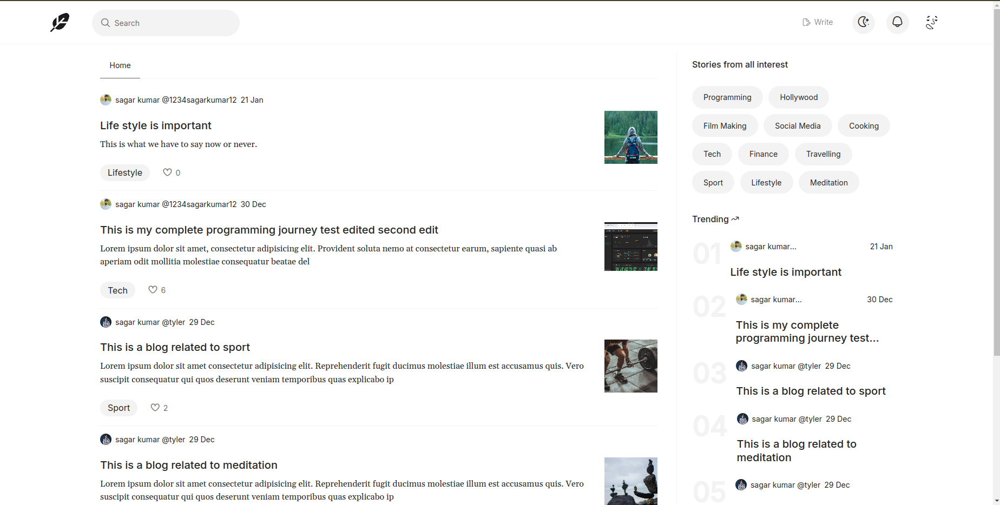
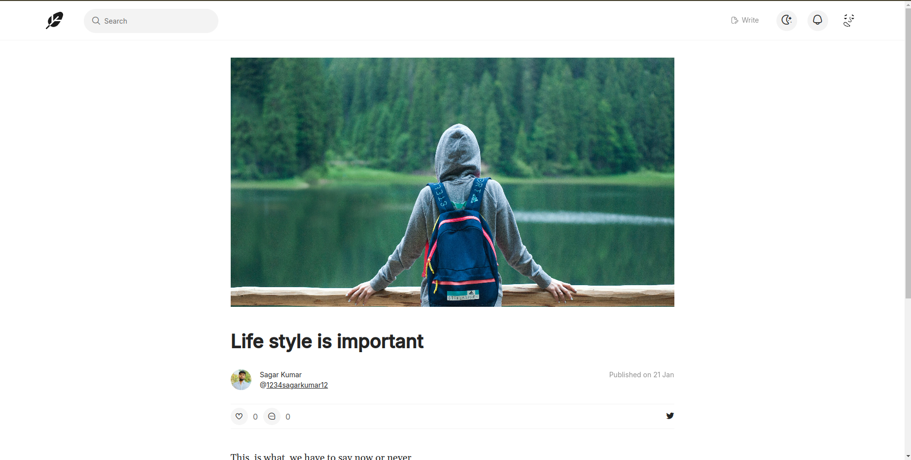
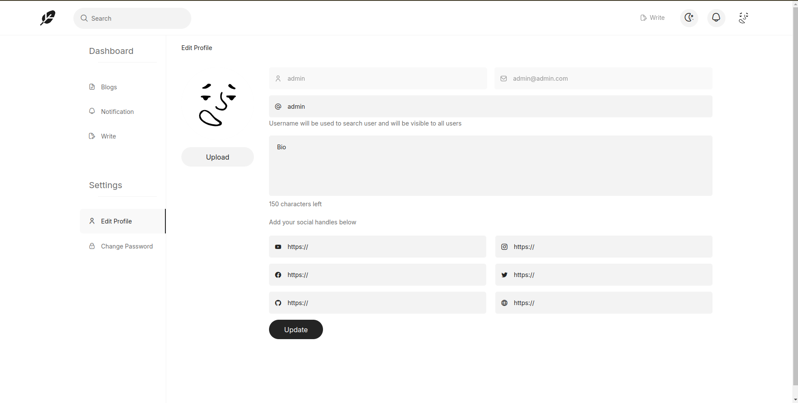
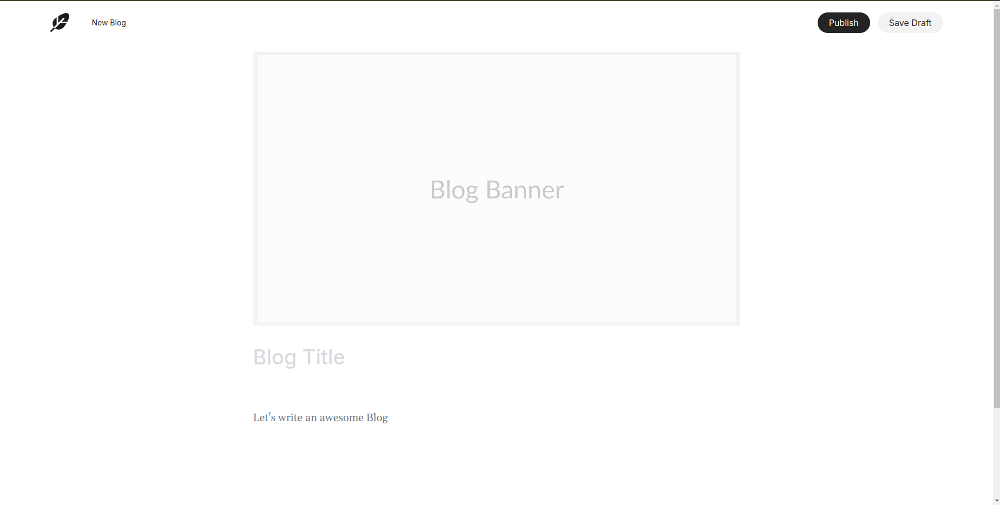

# Blogspace

This is a dynamic blogging platform that allows users to create, manage, and interact with blog posts. It includes features like Google authentication, a modern blog editor using Editor.js, blog post analytics, user profiles, and a nested comment system. The platform is designed with mobile responsiveness and offers a modern, smooth user experience. Planned features include real-time chat between authorized users to further enhance engagement.

## Tech Stack

**Client:** React, Context API, TailwindCSS

**Server:** Node, Express, Firebase

**Databse:** MongoDb, Amazon S3

## Features

### Completed Features

- **Modern Blog Editor**: A rich, user-friendly blog editor powered by **Editor.js** for easy content creation.
- **Google Authentication**: Secure login and user authentication using **Google**.
- **Dynamic Blog Pages**: Automatically generated blog pages with dynamic URLs based on the content.
- **Search Page**: A dedicated page for searching blogs and users for easy navigation and discovery.
- **User Profiles**: Each user has a dedicated profile page showcasing their written blogs, social links, and personal information.
- **Blog Management Dashboard**: A dashboard for users to manage their blogs, with options to view, edit, publish, or save drafts.
- **Blog Post Analytics**: Detailed insights on blog performance with options to edit or delete posts.
- **Blog Interactions**: Users can like blogs and comment on posts, promoting engagement.
- **Nested Comment System**: A reply feature to comments, allowing users to have threaded discussions.
- **Notifications**: Every interaction on the site is logged as a notification for users, keeping them informed of all activities related to their account.
- **Recent Notifications Highlight**: A special section for highlighting recent notifications, making it easier to distinguish between new and old alerts.
- **Profile Customization**: Users can edit their profiles, updating social links, bio, and username to personalize their accounts.
- **Password Management**: Users have the ability to change their login password from the settings page for added security.
- **Mobile Responsiveness**: A fully responsive design that adapts seamlessly across devices, with a modern aesthetic and smooth page transitions enhanced by fade-in animations.

### Planned Features

- **Realtime Chat**: A messaging feature allowing authorized users to chat with each other in real-time.

## Installation

Follow the steps below to set up the project locally:

### Prerequisites

- Ensure you have **Node.js** and **npm** installed on your system.
- Clone the repository:
  ```bash
  git clone https://github.com/sagar1952115/blogspace.git
  ```

### Setting Up the Server

1 Navigate to the `server` directory:

```bash
cd blogspace/server
```

2 Install the dependencies:

```bash
npm install
```

3 Start the server:

```bash
npm run start
```

### Setting Up the Client

1 Navigate to the `client` directory:

```bash
cd ../client
```

2 Install the dependencies:

```bash
npm install
```

3 Start the client:

```bash
npm run dev
```

## Environment Configuration

This project requires `.env` file in for **server**. Each environment has specific configuration settings.

1. Navigate to the server directory:

   ```bash
   cd server
   ```

2. Create a .env file in the server directory and add the necessary environment variables.

Example .env for the server:

```bash
SECRET_ACCESS_KEY="your-secret-key"
AWS_SECRET_ACCESS_KEY="your-aws-secret-access-key"
AWS_ACCESS_KEY="your-aws-access-key"
MONGO_URL="your-mongo-url"
AWS_SDK_JS_SUPPRESS_MAINTENANCE_MODE_MESSAGE='your-mesage'
```

Make sure to replace the placeholder values with your actual configuration.

### Notes

- You may need to restart both the server and client after modifying `.env` files to apply the new settings.

## Screenshots

<div style="display: flex; flex-wrap: wrap; gap: 10px;">
  
  
  
  
</div>

## Demo

https://techspaceblogs.netlify.app/

## 🔗 Links

[](https://getmehere.netlify.app)
[](https://www.linkedin.com/in/sagar115)

## Feedback

If you have any feedback, please reach out to me at sagarkumarme1@gmail.com
